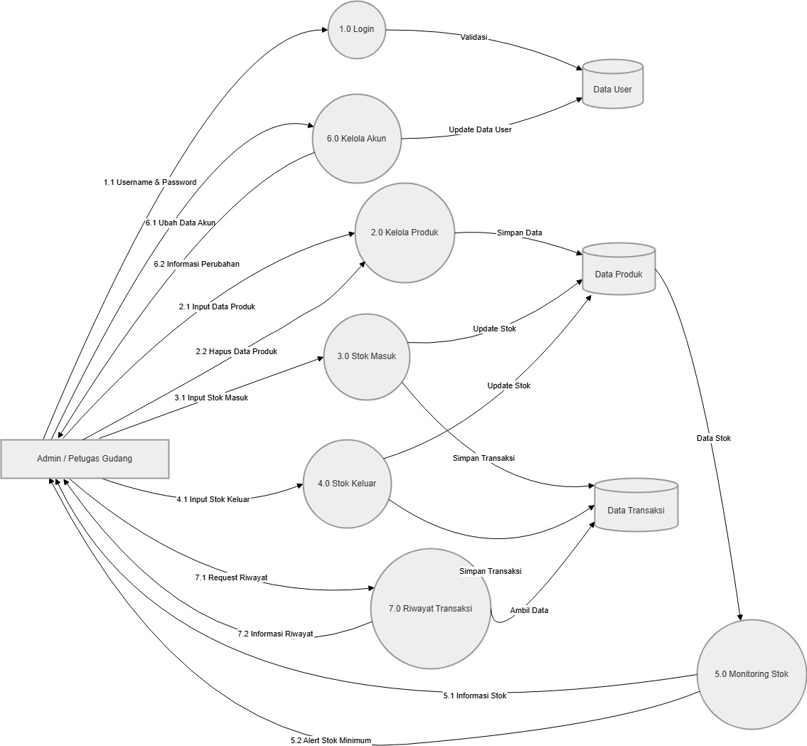
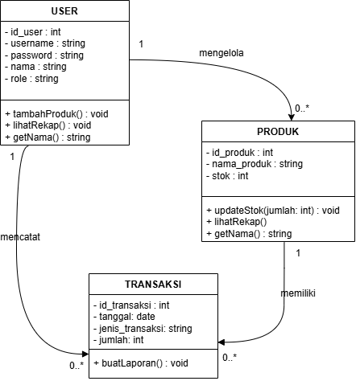
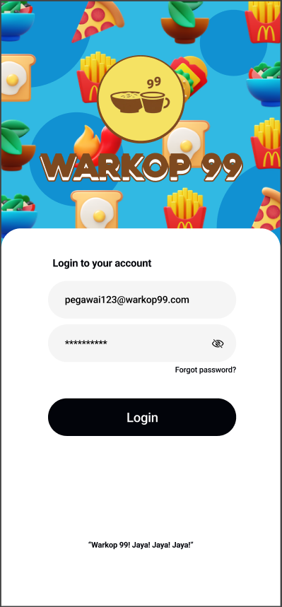
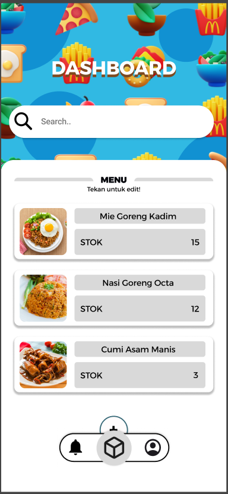

# 🚀 Tugas Besar: [Sistem Monitor Warkop 99]

> **Dosen Pengampu:** Muhammad Shiddiq Azis, S.T., MBA

---

## 🖼️ Perancangan Sistem (DFD)

### DFD Level 0

### DFD Level 1

---

## 📊 Class Diagram

---

## 📊 Entity Relationship Diagarm (ERD)

---

## 🎨 Mockup Antarmuka
Rancangan UI aplikasi yang berfokus pada pengalaman pengguna.

| Login Page | Dashboard | Edit Stock | Notification Segment | Profile Segment |
| :---: | :---: | :---: | :---: | :---: |
|  |  |  |  |  |

---

## 🛠️ Stack Teknologi
- **Frontend:** HTML + CSS + JS
- **Backend:** Python
- **Database:** PostgreSQL

---

## 📂 Cara Instalasi
1. `git clone https://github.com/108hills/SistemMonitorW99`
2. `npm install`
3. `npm run dev`
