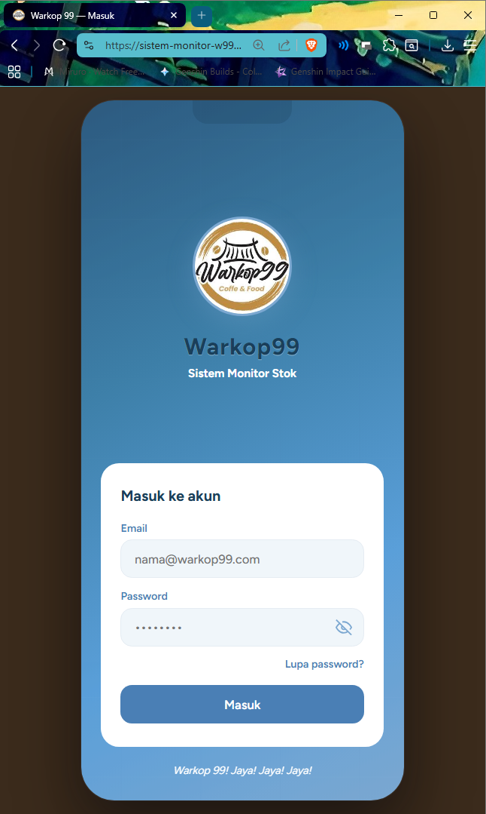
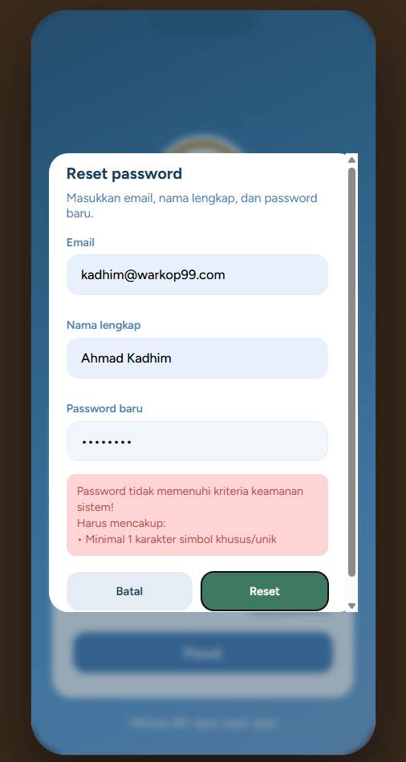
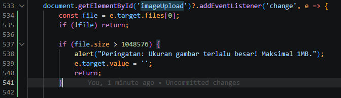
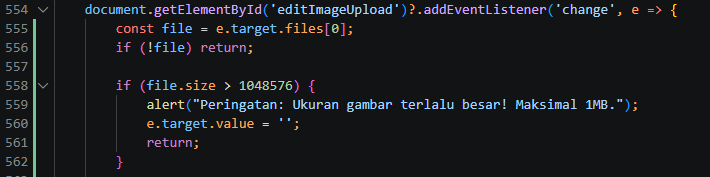
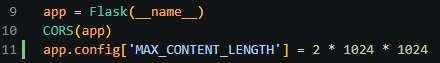
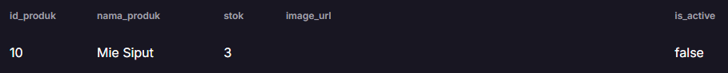

# Tugas Pengganti Kuis
## Implementasi Metrik Pengujian pada Proyek GitHub

**Tujuan**
Mahasiswa mampu menerapkan konsep metrik pengujian perangkat lunak pada proyek yang sedang dikembangkan sebagai tugas besar.

**Ketentuan**
* Tugas dikerjakan secara individu.
* Menggunakan repository GitHub tugas besar secara masing – masing.
* Buat folder dengan nama: `/docs/testing-metrics/`
* Di dalam folder tersebut buat file: `testing-report.md`

---

### Langkah 1 – Menentukan Fitur yang Diuji
Fitur yang dipilih:
* Authentication & Manajemen Sesi
* Stock Management
* Akun & Keamanan

### Langkah 2 – Membuat Test Case

**Tabel Test Case**

| No. | Fitur | Skenario | Expected Result | Status |
|---|---|---|---|---|
| 1 | Authentication | Login dengan username dan password valid | Mengembalikan status "success" dan menyimpan `loggedInUserId` di localStorage | Pass |
| 2 | Authentication | Login dengan kredensial salah | Mengembalikan error 401 dan memunculkan pesan "Email atau password tidak sesuai" | Pass |
| 3 | Authentication | Menekan tombol toggle mata (`#togglePassword`) pada kolom password | Tipe input berubah dari password menjadi text dan ikon mata berubah | Pass |
| 4 | Recovery | Klik "Lupa password?" membuka modal | Membuka `#forgotModal` dan menampilkan form | Pass |
| 5 | Recovery | Reset password dengan kombinasi email dan nama salah | API `/api/forgot-password` mengembalikan 404 | Pass |
| 6 | Recovery | Input password baru di bawah 8 karakter | Frontend memblokir aksi dan memunculkan peringatan kriteria keamanan sistem | Pass |
| 7 | Dashboard | Muat daftar produk dari server | Hanya merender produk dengan `is_active = TRUE` dan diurutkan berdasarkan `id_produk` | Pass |
| 8 | Dashboard | Mencari produk dengan input teks (`#searchInput`) | Tampilan `.product-card` difilter sesuai teks nama produk (tidak peka huruf besar/kecil) | Pass |
| 9 | Stok | Menambah produk baru dengan nama kosong | Muncul alert frontend "Nama produk tidak boleh kosong!" | Pass |
| 10 | Stok | Menambah produk beserta gambar | Gambar dikonversi melalui `FileReader` ke Base64 (`image_url`) dan dikirim ke server | Fail |
| 11 | Stok | Memperbarui stok (tambah/kurang) | Mencatat riwayat transaksi dengan tipe "UPDATE (old -> new)" | Pass |
| 12 | Stock | Menghapus produk lewat mode delete | Produk tidak dihapus dari DB melainkan di-set `is_active = FALSE` | Pass |
| 13 | Notifikasi | Memeriksa list stok rendah | Produk dengan `stok <= 5` muncul dan diberi badge "Stok Rendah" warna merah | Pass |
| 14 | Akun | Ubah password dengan verifikasi tidak cocok | Pembaruan ditolak dengan pesan "Gagal: Verifikasi password baru tidak cocok" | Pass |
| 15 | Akun | API mengganti profil foto | Memperbarui kolom `profile_url` di tabel users dengan representasi Base64 | Fail |

### Langkah 3 – Menghitung Metrik
Berdasarkan hasil test case di atas:
* **Total Test Case:** 15
* **Pass Rate:** (13/15) * 100% = **86.67%**
* **Fail Rate:** (2/15) * 100% = **13.33%**
* **Defect Count:** 2 Bug Total (0 Critical, 1 Major, 1 Minor)
* **Defect Density:** (2 Bug / 3 Fitur) = **0.67 bug per fitur**

### Langkah 4 – Dokumentasi Bukti

* **Halaman Login W99**
  

* **Frontend menolak password baru yang tidak memakai simbol khusus**
  

* **Perbaikan bug dimana file media yang besar dapat diupload tanpa restriction**
  
  
  

* **Produk yang dihapus akan diubah menjadi is_active=false**
  

### Langkah 5 – Analisis

**1. Fitur mana yang paling banyak gagal?**
Kegagalan dominan ditemukan pada fitur yang melibatkan *upload* file gambar (Menambah produk dan memperbarui foto profil).

**2. Apa penyebabnya?**
Aplikasi mengandalkan API `FileReader` sisi *client* untuk *convert* gambar secara langsung menjadi string Base64 (`base64Image`) sebelum mengirimkannya melalui *body* JSON ke server backend Flask. Tidak ada cara pembatasan ukuran file (*file size limit validation*) di sisi *frontend* maupun *backend*, sehingga pengguna yang mengunggah gambar resolusi tinggi (misal > 5MB) akan memicu *freezing* di *browser* atau melebihi *limit payload request* di server.

**3. Bagaimana cara memperbaikinya?**
Di sisi *frontend*, tambahkan *compression* gambar menggunakan elemen HTML5 `<canvas>` atau minimal batas validasi `file.size` pada *event listener* `change`. Di sisi *backend*, konfigurasikan `MAX_CONTENT_LENGTH` pada server Flask agar merespon dengan rapi jika batas *payload* terlampaui.

**4. Apa prioritas perbaikannya?**
**Major**. Mengirim representasi Base64 yang masif tidak hanya memberatkan respon REST API, tapi juga akan berdampak pada performa database PostgreSQL secara keseluruhan ketika ukuran tabel membengkak.

**5. Jika aplikasi akan dirilis minggu ini, apakah sudah layak? Jelaskan.**
Sistem sebetulnya sudah bisa dirilis karena fungsionalitas kritis (manajemen stok, pencatatan log transaksi, keamanan password *hash*, proteksi mode akses) berjalan sempurna (Pass Rate > 85%). Rilis dapat dilakukan dengan memberikan *temporary constraint* berwujud *disclaimer* batasan ukuran unggahan foto maksimal 1MB hingga perbaikan pada kompresi gambar selesai diselesaikan.